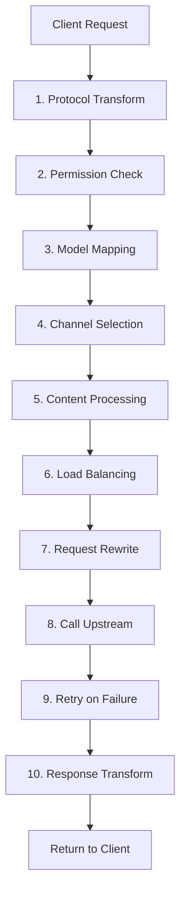

# Request Processing Guide

This guide explains the main steps a request goes through in AxonHub. Its goal is to give you a simple and accurate mental model.

## One-Sentence Summary

AxonHub converts the request into a unified format, selects a channel based on configuration, and converts the result back into the format the client expects.

## Core Concept: Three Layers of Model Settings

AxonHub has three places that affect model names:

| Layer | Configuration Location | Purpose | Simple Analogy |
|-------|------------------------|---------|----------------|
| Layer 1 | API Key Profile | Rewrite the client's requested model name | "What to ask for" |
| Layer 2 | Model Association | Choose which channel handles the request | "Where to go" |
| Layer 3 | Channel Configuration | Rewrite the model name sent upstream | "What to call it" |

**Processing Order**: API Key Profile renames → Model Association selects channel → Channel renames → Send upstream

## End-to-End Flow



## Stage Overview

### 1. Protocol Transform

AxonHub supports multiple API formats, such as OpenAI, Anthropic, and Gemini. It first converts them into one internal format.

### 2. Permission Check

The system checks the basic limits of the API Key and the active Profile, such as:
- whether the API Key is valid
- whether quota is exceeded
- whether the requested model is allowed

If this step fails, the request stops here.

### 3. Model Mapping

This is the first layer of model-name rewriting, controlled by the API Key Profile.

Example:

```
Client request: gpt-4
    ↓
API Key Profile: gpt-4 → claude-3-opus
```

### 4. Channel Selection

The system uses Model Association to decide which channels can handle the request.

This step usually considers:
- model-level association rules
- developer rules from the same model developer, unless the model has **Do not inherit developer settings** enabled
- API Key Profile channel restrictions
- whether the channel is enabled

Developer rules select only a channel or channel tags. The concrete upstream model is matched from the current request's model ID, so one developer rule can serve multiple models from the same developer.

### 5. Content Processing

Before sending the request upstream, AxonHub may also apply:
- prompt injection
- prompt protection

### 6. Load Balancing

If there are multiple candidate channels, AxonHub decides which one to try first.

Common factors include:
- channel weight
- historical state
- current load

### 7. Request Rewrite

At the channel layer, AxonHub can further rewrite the upstream model name and request parameters.

### 8. Call Upstream

The system sends the request to the selected AI provider.

### 9. Retry on Failure

If the upstream call fails, AxonHub may retry or switch to the next candidate channel.

### 10. Response Transform

The system converts the upstream result back into the format the client expects and records the result.

## Which Document to Read Next

| If your question is | Read this |
|---------------------|-----------|
| How do I rename the requested model? | API Key Profile |
| How do I choose which channel handles the request? | Model Association |
| How do I change the upstream model name or request parameters? | Channel Management |

## Related Documentation

- [Channel Management Guide](../guides/channel-management.md)
- [Model Management Guide](../guides/model-management.md)
- [API Key Profile Guide](../guides/api-key-profiles.md)
- [Load Balancing Guide](../guides/load-balance.md)
