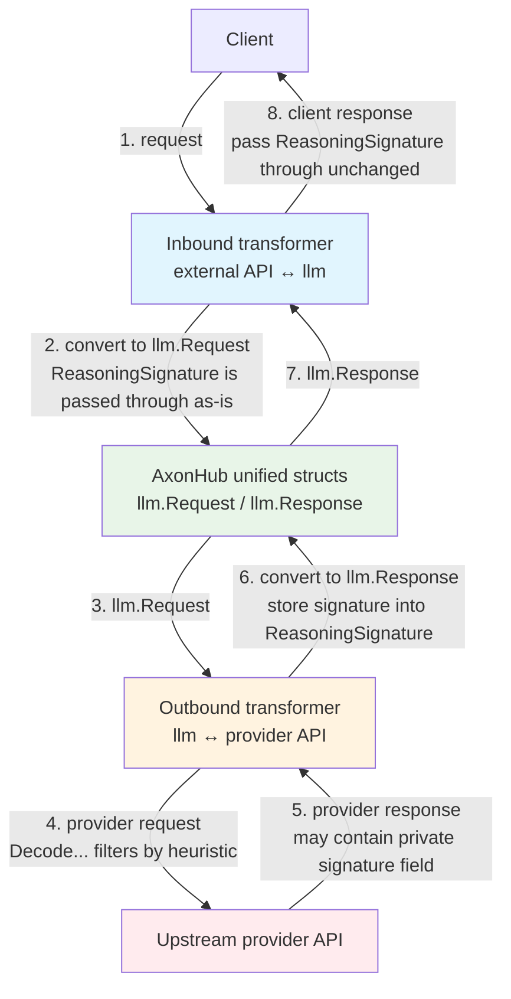

# Shared Transformer Helpers

This folder contains small, provider-agnostic helpers used by multiple transformers.
The most important concept here is the **signature filtering** scheme used to make
provider-specific private protocols survive **same-session channel/model switching**.

## Problem: same-session switching breaks provider private protocols

In AxonHub a single user session can route consecutive turns through different
channels/providers/models (load-balancing, failover, or a user switching channels).

Some providers emit extra "private protocol" fields that other providers don't
understand, for example:

- Anthropic extended thinking signature
- Gemini thought signature
- OpenAI Responses `reasoning.encrypted_content`

If these values are forwarded naively, they can be dropped, mis-parsed, or paired
with incompatible fields when the session switches providers, and then switching
back loses context and may degrade model behavior.

Worse, forwarding an incompatible signature to a downstream model causes hard
failures — e.g. `invalid_request_body` with "encrypted content could not be
verified" — because the downstream model attempts to decrypt/verify a blob that
was produced by a different provider.

## Terminology: inbound vs outbound transformers

In this repository, **inbound/outbound** are named from AxonHub's point of view:

- **Outbound transformer**: converts unified structs to an upstream provider request, and converts the upstream provider response back into unified structs.
  - request direction: `llm.Request` -> provider request
  - response direction: provider response -> `llm.Response`
- **Inbound transformer**: converts a client request (in some external API format) into unified structs, and converts unified structs back into that external API response format.
  - request direction: client request -> `llm.Request`
  - response direction: `llm.Response` -> client response

For streaming, apply the same naming convention to stream events/items in each direction.

## Design: heuristic-based signature filtering

We store these provider-specific values in the unified message field
`llm.Message.ReasoningSignature` as an **internal transport field**.

At each outbound provider boundary, `Decode...` helpers use
`GuessSignatureProvider` — a heuristic that inspects the raw blob — to decide
whether the signature is safe to forward to the target provider. Only signatures
that are **positively identified** as belonging to the target provider are kept;
everything else (including `unknown`) is dropped.

### Heuristics (`GuessSignatureProvider`)

| Pattern | Provider |
|---------|----------|
| `gAAAA*` / `gAAA*` prefix | OpenAI |
| `EqQ*` / `Eqo*` / `Eqr*` prefix | Anthropic |
| standard base64 with protobuf-like decoded bytes | Gemini |
| anything else | `unknown` (filtered by all `Decode...` helpers) |

### Behavioral contract (how it survives switching)

1. A provider response that contains a signature-like field is stored in
   `llm.Message.ReasoningSignature` (Encode helpers are passthrough).
2. Inbound conversions return the value back to the client unchanged.
3. On the next request, the client echoes the value unchanged.
4. When routing switches, outbound transformers call `Decode...` which only
   forwards the signature if `GuessSignatureProvider` identifies it as belonging
   to the target provider; otherwise the signature is **dropped** (do not
   forward private protocol fields across providers).

Practical invariants:

- **Strict filtering**: all three `Decode...` helpers (OpenAI, Anthropic, Gemini) only keep signatures positively identified as their own provider. `unknown` signatures are filtered to prevent `invalid_request_body` errors from downstream models.
- **At provider edges**: a transformer decodes **only when required by that provider API**, and only when the heuristic matches that provider (otherwise drop on mismatch).
- **Anthropic-specific exception**: decode is only required for Anthropic official platforms (`direct`, `claudecode`, `vertex`, `bedrock`). For other Anthropic-compatible outbound platforms, AxonHub forwards the value unchanged.

### Mermaid: end-to-end encode/decode flow

## OpenAI Responses API note (why inbound must not decode)

OpenAI Responses has a `reasoning` output item with `encrypted_content`.
If AxonHub decodes/removes the value on inbound conversion, the client
will send the next request without it, and AxonHub can no longer identify
which provider protocol the signature belongs to.

Therefore:

- **Responses outbound (llm -> OpenAI Responses request)** calls
  `DecodeOpenAIEncryptedContent` which only forwards the blob if
  `GuessSignatureProvider` identifies it as OpenAI.
- **Responses inbound (OpenAI Responses response -> llm)** stores
  `encrypted_content` in `ReasoningSignature` as-is (Encode is passthrough).
- **Responses inbound-stream (llm stream -> OpenAI Responses SSE)** passes
  through the signature as `encrypted_content` (do not decode).

This keeps the session round-trip stable even if the client only "speaks" OpenAI
Responses and AxonHub switches the actual upstream provider behind the scenes.

## Evolution note

An earlier version of this design used a **footprint-aware internal marker**
scheme: Encode/Decode helpers accepted a `footprint` parameter and wrapped raw
values with a stable marker prefix so the signature could be matched against the
expected transport scope.

The current version replaces that with the **heuristic-based** approach described
above (`GuessSignatureProvider`). The Encode/Decode helpers no longer take a
`footprint` parameter; instead, `Decode...` inspects the raw blob to decide
whether it is safe to forward to the target provider.

## Practical guidance

- When adding a new provider-specific signature-like field, prefer:
  1) add detection patterns to `GuessSignatureProvider`,
  2) add `Encode/Decode` helpers around it,
  3) store it in `llm.Message.ReasoningSignature`,
  4) forward/decode only at the target provider boundary (drop on mismatch).
